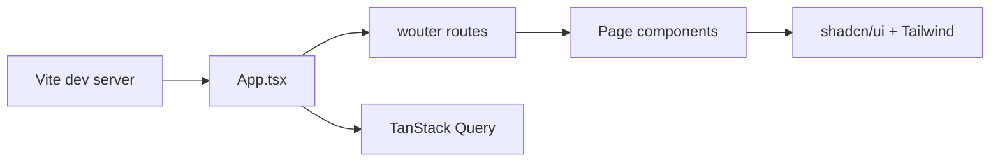

<div align="center">

# RentFlow

### Real estate rental platform — browse, finance, and discover homes

[](https://react.dev/)
[](https://www.typescriptlang.org/)
[](https://vite.dev/)
[](https://tailwindcss.com/)

<br/>

[]()
[]()
[]()

<br/>

[](https://github.com/hackerbotfz/rentflow/commits)
[](https://github.com/hackerbotfz/rentflow)
[](https://github.com/hackerbotfz/rentflow/stargazers)

<br/>

**[Faiz Lawan](https://github.com/hackerbotfz)**

</div>

---

**RentFlow** is a front-end real estate platform for browsing rental and sale listings, exploring property galleries, connecting with agents, and using built-in tools like a mortgage calculator. The UI is a multi-page React SPA with animated layouts, filterable galleries, and auth screens (login, signup, password reset).

## Overview

| Detail | Value |
|--------|--------|
| **Type** | Single-page app (client-side routing) |
| **Listings** | Featured properties with filters by type and location |
| **Gallery** | Filterable photo grid (interior, exterior, outdoor) |
| **Tools** | Mortgage / finance calculator, rent & sell flows |
| **Auth UI** | Sign in, sign up, forgot password (front-end only) |

## Pages

| Route | Page |
|-------|------|
| `/` | Home — hero, featured listings, testimonials |
| `/features` | Property listings with filters |
| `/gallery` | Photo gallery |
| `/realtor` | Agent profiles |
| `/finance` | Mortgage calculator |
| `/rent` | Rent a home |
| `/sell` | Sell a home |
| `/overview` | About RentFlow |
| `/testimonials` | Client stories |
| `/careers` | Careers |
| `/help` | Help center |
| `/login` | Sign in |
| `/signup` | Create account |
| `/forgot-password` | Password reset |
| `/privacy` | Privacy policy |
| `/terms` | Terms of service |

## Architecture



`App.tsx` wraps the app in TanStack Query and tooltips, then routes between auth layouts (no navbar) and main layouts (navbar + footer). Page data is static mock content; images load from Unsplash CDN.

## Tech stack

React 19 · TypeScript · Vite 6 · Tailwind CSS v4 · shadcn/ui · wouter · framer-motion · TanStack Query · lucide-react

## Run

```bash
npm install
npm run dev
```

Dev server: [http://localhost:3000](http://localhost:3000)

```bash
npm run typecheck   # TypeScript check
npm run build       # Production build → dist/
npm run preview     # Preview production build
```

## Repository

```
rentflow/
├── index.html
├── package.json
├── vite.config.ts
├── tsconfig.json
├── src/
│   ├── App.tsx
│   ├── main.tsx
│   ├── index.css
│   ├── components/
│   │   ├── layout/     # Navbar, Footer
│   │   └── ui/         # shadcn/ui primitives
│   ├── pages/          # Route pages
│   ├── hooks/
│   └── lib/
└── README.md
```

## License

© Faiz Lawan. See [LICENSE](LICENSE).
